# Castle Climber
- Authors: [Anand Mahadevan](https://github.com/AnandMaha) [Husam Chekfa](https://github.com/HusamChekfa) [Vinay Srinivasan](https://github.com/vsrin008)

## Project Description
 - We are interested in video games and how they are coded.
 - Language - C++
 - Player will see a menu and input their character's actions (attack, heal, use item, see help/instructions, give up, etc...) and the output will be the result of the input (DEALT 100 DAMAGE, HEALED 25, USED STRENGTH POTION), and what the enemy does (SLAMS HAMMER FOR 200 DAMAGE, *ENEMY* HEALS FOR 13 HEALTH, USE HEAL POTION)
 - Factory. The game will have three difficulties to choose from: easy, medium, and hard. Those difficulties will differ from the enemies' health and the heroes' attacks, with harder difficulties having more enemy health and less hero attack. There will be three concrete factorties (Easy_Game, Med_Game, Hard_Game) derived from one abstract factory which will all implement the play_game() function. In each of the three, various values will be set in the enemies' and heroes' constructors, modifying the initial variables mentioned above. The Factory design pattern is useful here where we want to have numerous ways to modify the rules of our game before starting to play, and is useful in easily allowing us to add more difficulties or "fun" modes of the game in the future.

 - Strategy. In the game, all of heroes' and enemies' attack, special, and use_item will be performed in 6 methods, 3 for heroes, 3 for enemies. Those 3 functions will need to check for different types of hero/enemy objects passed to it, and perform proper algorithms to handle them. We will have a fight function in the Hero class and an Enemy pointer to determine how the fight between the two Objects will play out. Within the method, there will be class specific changes that will take place for both the Heroes and the Enemies. Strategy pattern is very useful in this method because the fight plays out very similar between all the Heroes in terms of function calls, and very specific changes in the fight in regards to the mini-boss and final-boss enemies can be handled very simply within this method. Other that that, the enemies behave very similarly in the fight in terms of function calls just like the heroes. Strategy pattern is very useful here when wanting to avoid duplicating a fight method's code between every hero and enemy combination. (That would result in 30 fight methods!)
 

## Class Diagram
  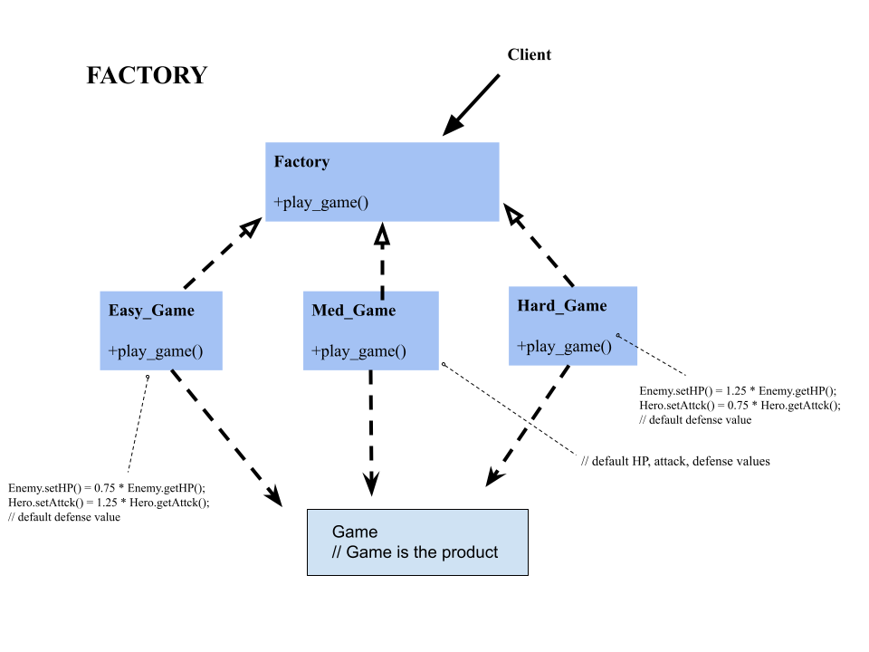
  
  Our class diagram shows the factory pattern through our implementation of different difficulties of the game. After launching the game, the user is prompted with choosing one of three difficulties (Easy, Medium, and Hard). After choosing the difficulty, the factory object is set to either Easy_Game, Med_Game, or Hard_Game. Then, the factory object calls play_game() and the game commences. This factory pattern allows our main function to be small and readable as compared to our earlier implementation where the game was running entirely in the main function.
  
  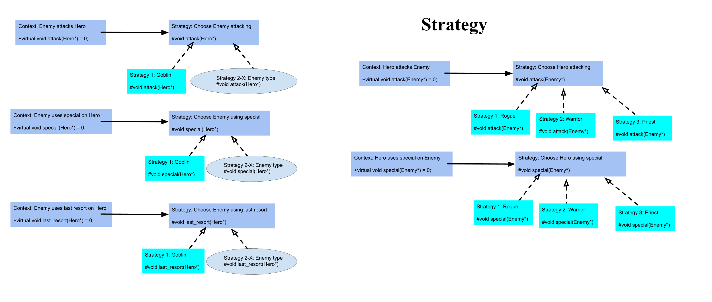
  
 Our class diagram shows the usage of the strategy pattern because certain functions have different interactions depending on the object calling them and the objects in their paramaters. We want to use different functionalities for the attack, special, and use_item functions for the Hero and the Enemy class. So, instead of placing these three functions in the Character class, we set them in Hero and then again in Enemy. Each of these functions interacts differently depending on who is calling them. For example, the Hero attack function works differently when called by a Warrior than when called by a Priest. The same goes for the special abilities and the item usages on the three Hero child classes. Again, for the Enemy class, the three functions interact differently depending on the Enemy object calling them. Suppose Goblin calls the special function. The Goblin's special will be quite weak in comparison to the final boss' special function.
 
 ## Screenshots
 - Screenshot of game intro.

 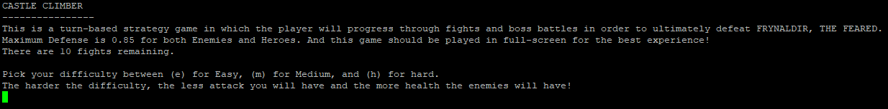
  
 - Screenshot of hero being selected.

 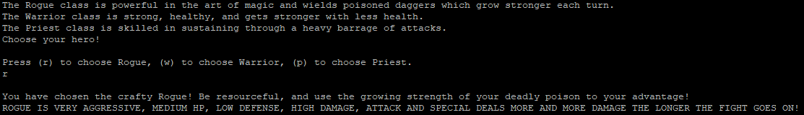
 
 - Screenshot of user selecting game details.
 
 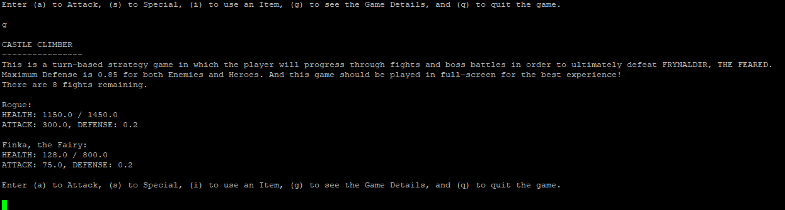
 
 - Screenshot of intro of Fight 10 Text
 
 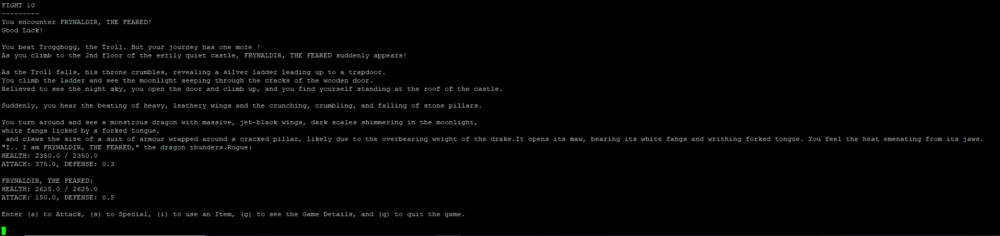
 
 - Screenshot of attacking.
 
 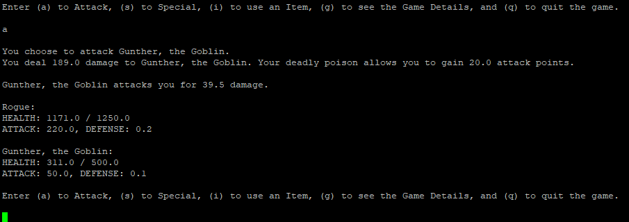
 
 - Screenshot of user using special.
 
 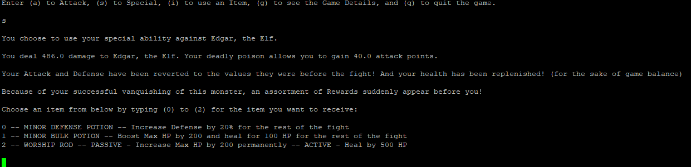
 
 - Screenshot of user trying to use special before it is ready to use.
 
 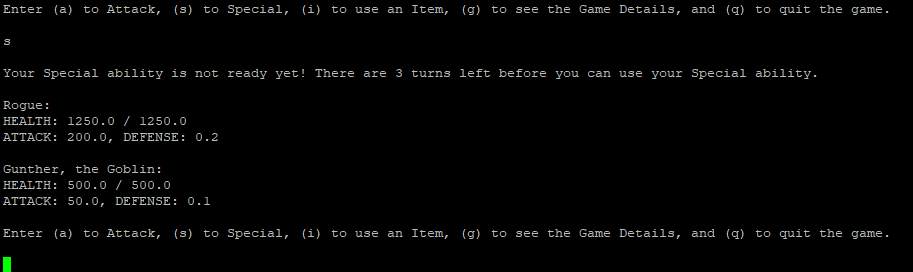
 
 - Screenshot of enemy using special.
 
 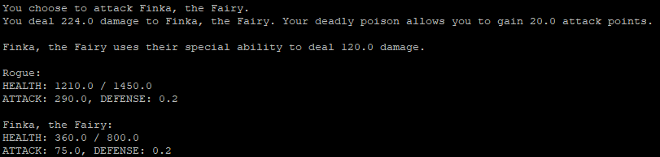
 
 - Screenshot of user using a lucky gamble potion.
 
 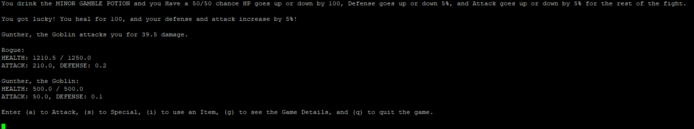
 
 - Screenshot of user using a mythic item.
 
 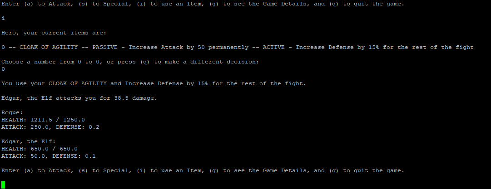
 
 - Screenshot of user trying to use an already used mythic item.
 
 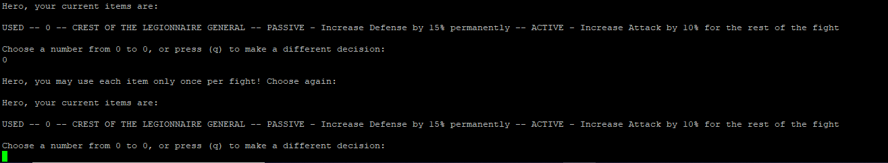
 
 - Screenshot of user winning a fight.
 
 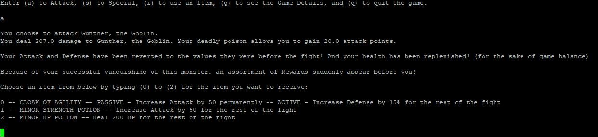
 
 - Screenshot of user losing a fight, causing the game to end.
 
 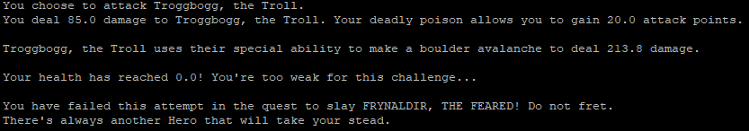
 
 - Screenshot of victory screen.
 
 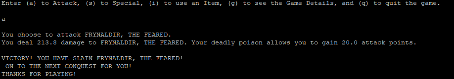

 ## Testing
 - Valgrind screenshot after immediately selecting character and quitting game.

 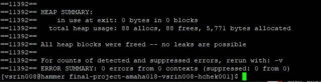

 - Valgrind screenshot after completion of game.
 
 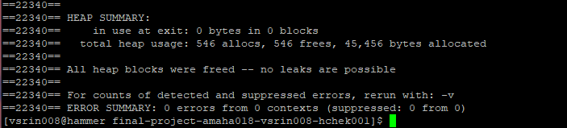
 
 - Screenshot of an invalid difficulty input.

 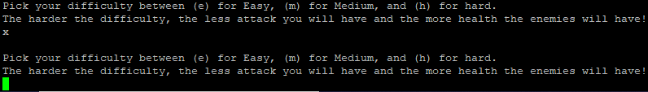
 
 - Screenshot of an invalid hero selection input.
 
 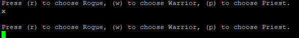
 
 - Screenshot of user selecting an invalid action in a fight.
  
 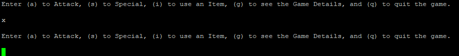
 
 - Screenshot of an invalid item selection.
 
 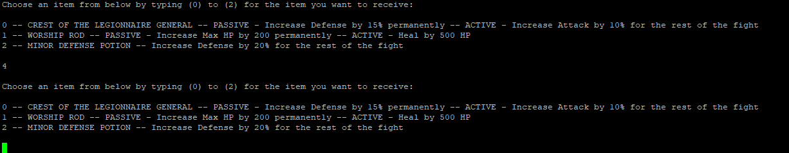
 
 - Our testing consists of comparing expected values of stats like HP and Attack to their experimental values upon calling the different functions, like attack and use_item.
 - The first part of the image shows our cError function checks if the test passed. It exits with error code (1) if the expected and actula values are different. Otherwise, the testing continues. It is a homemade assert function.
 - Part two shows an example test suite. This test suite tests the last resort functionality of the enemy class. We had similar suites for the attack, special, and activate_item functions along with a couple of miscellaneous tests, which checked the setDfnse and setHP functions from the Character class.
 - Part three shows the main function of this testing file. It calls each test suite and has print statements declaring tests starting and all tests passing. 
 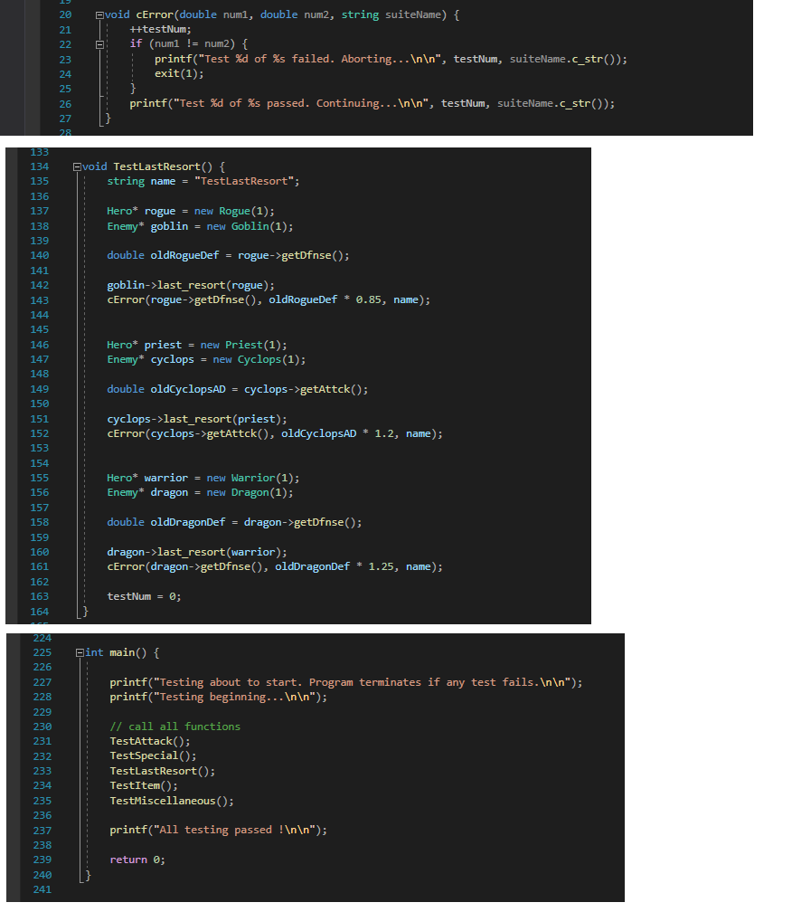

 - Screenshot of some of the passing tests in the terminal.
 - Note: All tests in test.cpp passed.
 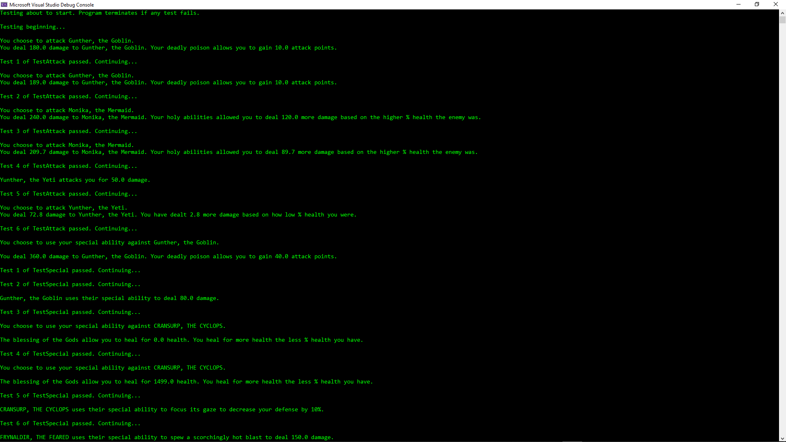

 ## Installation/Usage
- Download the .exe file from Releases, and play from your terminal window.
